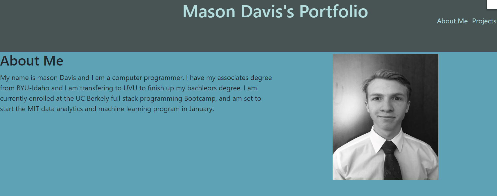

# Portfolio-Mason-Davis


## Deployed link
* [Portfolio]()

## site picture



## Technologies Used
- HTML : Used to format the content of the page
- CSS : Used to style the HTML on the web browser
- JavaScript : Used to give the page logical functions and a dynamic interface
- Git : Used to version control the code during the creation process
- GitHub : hosting the repositroy responsible for the website

## Authors
- writen styled and built by Mason Davis

## summary
This repository contains all the code to generate a reposotory portfolio for mason davis. it is a resume and contact form meant to inform others of Me Mason Davis 

## Code Snippet
This is a snippet Showing the formula used to require a real email from the contact form

```javaScript
    const handleKeyUp = (e) => {
    let email = document.querySelector("#email").value;
    const re =
    /^([a-z0-9_\.-]+)@([\da-z\.-]+)\.([a-z\.]{2,6})$/
    let vTest = re.test(String(email).toLowerCase());
    if(vTest){
        setValidate (false)
    }
    else{
        setValidate (true)
    }
  }; 
```


## Author links
[LinkedIn](https://www.linkedin.com/in/davis-mason-t/)
[GitHub](https://github.com/Md7113)